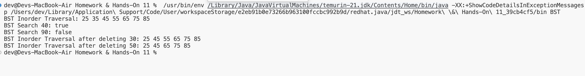
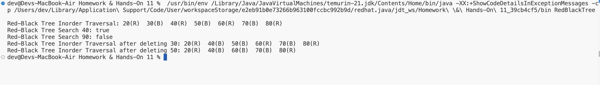
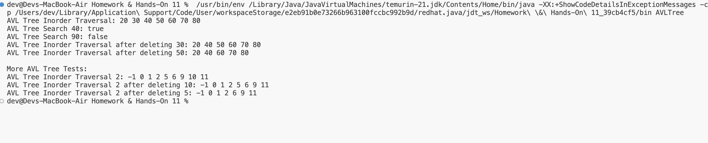

# HandsOn_8

# Problem 1

* Code for The basic Binary Search Tree is given [`BST.java`](BST.java)

 
<b>Output:</b>

 
 

# Problem 2

*  Code for RedBlack Tree is given [`RedBlackTree.java`](RedBlackTree.java)
 

<b>Output:</b>

# Problem 3

*  Code for AVL Tree is given [`AVL_Tree.java`](AVL_Tree.java)
 

<b>Output:</b>

